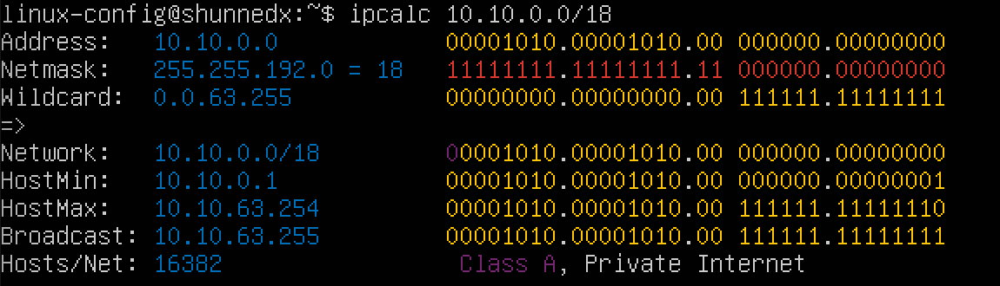

# Linux Network

## Part 1. Инструмент ipcalc
___

- Установим ipcalc при помощи команды:

``` shell
sudo apt install ipcalc
```

### 1.1. Сети и подмаски

1. Адрес сети 192.167.38.54/13

``` shell
ipcalc 192.167.38.54/13
```


2. Перевод маски

- Перевести маску 255.255.255.0 в префиксную и двоичную записи:

``` shell
ipcalc 255.255.255.0
```


- /15 в обычную и двоичную

``` shell
ipcalc 0.0.0.0/15
```


- 11111111.11111111.11111111.11110000 в обычную и префиксную

``` shell
ipcalc 0.0.0.0/28
```


3. Минимальный и максимальный хост в сети 12.167.38.4 при масках:

- /8:

``` shell
ipcalc 12.167.38.4/8
```


- 11111111.11111111.00000000.00000000:

``` shell
ipcalc 12.167.38.4/16
```


- 255.255.254.0:

``` shell
ipcalc 12.167.38.4/23
```


- /4:

``` shell
ipcalc 12.167.38.4/4
```


### 1.2. Localhost

1. Определить и записать в отчёт, можно ли обратиться к приложению, работающему на localhost, со следующими IP: 194.34.23.100, 127.0.0.2, 127.1.0.1, 128.0.0.1

- Можно:

``` shell
ipcalc 127.0.0.2
```


``` shell
ipcalc 127.1.0.1
```


- Нельзя:

``` shell
ipcalc 194.34.23.100
```


``` shell
ipcalc 128.0.0.1
```


### 1.3. Диапозоны и сегменты сетей

1. Какие из перечисленных IP можно использовать в качестве публичного, а какие только в качестве частных: 10.0.0.45, 134.43.0.2, 192.168.4.2, 172.20.250.4, 172.0.2.1, 192.172.0.1, 172.68.0.2, 172.16.255.255, 10.10.10.10, 192.169.168.1

Приватные IP-адреса:

``` shell
ipcalc 10.0.0.45
```


``` shell
ipcalc 192.168.4.2
```


``` shell
172.20.250.4
```


``` shell
ipcalc 172.16.255.255
```


``` shell
ipcalc 10.10.10.10
```


Публичные IP-адреса:

``` shell
ipcalc 134.43.0.2
```


``` shell
ipcalc 172.0.2.1
```


``` shell
ipcalc 192.172.0.1
```


``` shell
ipcalc 172.68.0.2
```


``` shell
ipcalc 192.169.168.1
```


2) какие из перечисленных IP адресов шлюза возможны у сети 10.10.0.0/18: 10.0.0.1, 10.10.0.2, 10.10.10.10, 10.10.100.1, 10.10.1.255



* Возможны: 
```shell
10.10.0.2;
10.10.10.10;
10.10.1.255.
```
* Невозможны:
```shell
10.0.0.1;
10.10.100.1.
```

## Part 2. Статическая маршрутизация между двумя машинами
___

Перезапустим ВМ и применим текущие конфигурации netplan к работающим системам:

```shell
sudo netplan apply
```

> При помощи команды ```ip a``` смотрим существующие сетевые интерфейсы 


* Аналогично эту информацию можно посмотреть с помощью команды 
```shell
ifconfig -a
```


* Для данного процесса потребуется установка утилиты net-tools, если она ранее не была установлена:
```shell 
sudo apt install net-tools
```

> Описать сетевой интерфейс, соответствующий внутренней сети, на обеих ВМ:

1. ```lo``` или ```local loopback``` - это интерфейс, который служит для подключения по сети к этому же компу и не требует доп. настроек.

```shell
- ws1: 127.0.0.1/8
- ws2: 127.0.0.1/8
```

2. ```enpos3``` - первый сетевой адаптер, работающий в NAT-режиме. Нужен для доступа в локальную сеть.

> NAT (Network Address Translation) - это механизм в сетях TCP/IP, позволяющий преобразовывать IP-адреса транзитных пакетов.

```shell
- ws1: 10.0.2.15/24
- ws2: 10.0.2.15/24
```

- Задать следующие адреса и маски:

```shell
- ws1 - 192.168.100.10, маска /16, 
- ws2 - 172.24.116.8, маска /12
```

При помощи редактора Nano редактируем config:

```shell
sudo nano /etc/netplan/00-installer-config.yaml
```


> Перезапускаем сервис сети:

```shell
sudo netplan apply
```


### 2.1. Добавление статического маршрута вручную

> Добавить статический маршрут от одной машины до другой и обратно при помощи команды вида `ip r add`

Для ws1:

```shell
sudo ip r add 172.24.116.8 dev enp0s8
```

Для ws2:

```shell
sudo ip r add 192.168.100.10 dev enp0s8
```

> Не забываем добавить сеть в настройках VirtualBox'a и пингуем соединение между машинами


ws1:

```shell
sudo ping -с 4 172.24.116.8
```


ws2:

```shell
sudo ping -с 4 192.168.100.10
```


### 2.2. Добавление статического маршрута с сохранением

> Перезапускаем машины и добавляем статический маршрут от одной машины до другой с помощью /etc/netplan/00-installer-config.yaml

```shell
sudo nano /etc/netplan/00-installer-config.yaml
```


## Part 3. Утилита iperf3
___
### 3.1 Скорость соединения

> Перевести и записать в отчёт: 8 Mbps в MB/s, 100 MB/s в Kbps, 1 Gbps в Mbps

Проявим немного ясности:
- Mbps - мегабит в секунду;
- MB/s - мегабайт в секунду;
- Kbps - килобит в секунду;
- Gbps - гигабит в секунду;

```shell
- 8 Mbps = 1 MB/s
- 100 MB/s = 800 000 Kbps
- 1 Gbps = 1000 Mbps
```

### 3.2. Утилита iperf3

- Для начала, установим утилиту `iperf3`

```shell
sudo apt install iperf3
```

> Измерить скорость скорость соединения между ws1 и ws2

- Подключаемся к удаленной машине, которая будет использовать в качестве сервера, запускаем iperf3 в режиме "Сервер" благодаря флагу -s. По-умолчанию он будет прослушивать порт 5201

ws1:
```shell
iperf3 -s
```


- На локалке, которую мы будем рассматривать как клиент (как раз, где происходит бенчмаркинг), запускаем iperf3 в режиме client. Используя флаг -c, указывая хост, на котором работает сервер (используя либо его IP-адрес, либо домен, либо имя хоста)


ws2:


## 4. Сетевой экран
___
### 4.1 Утилита iptables

> Создать файл ```/etc/firewall.sh```, имитирующий фаерволл, на ```ws1``` и ```ws2```. Нужно добавить в файл подряд следующие правила:

1) на ```ws1``` применить стратегию когда в начале пишется запрещающее правило, а в конце пишется разрешающее правило (это касается пунктов 4 и 5)

2) на ```ws2``` применить стратегию когда в начале пишется разрешающее правило, а в конце пишется запрещающее правило (это касается пунктов 4 и 5)

3) открыть на машинах доступ для порта 22 (ssh) и порта 80 (http)

4) запретить echo reply (машина не должна "пинговаться”, т.е. должна быть блокировка на OUTPUT)

5) разрешить echo reply (машина должна "пинговаться")

```shell
sudo apt-get install iptables
sudo nano /etc/firewall.sh
```


>Запускаем файлы на обеих машинах командами:

```shell
sudo chmod +x /etc/firewall.sh
/etc/firewall.sh
```


- Правило в конце файло отменяет все предыдущие, которые ему противоречат. Однако, не перезаписывает их.

### 4.2 Утилита nmap

> Командой ping найти машину, которая не "пингуется", после чего утилитой nmap показать, что хост машины запущен

```shell
sudo apt-get install nmap
```


## 5. Статическая маршрутизация сети
___

> Поднять пять виртуальных машин (3 рабочие станции (ws11, ws21, ws22) и 2 роутера (r1, r2))

### 5.1 Настройка адресов машин

> Настроить конфигурации машин в etc/netplan/00-installer-config.yaml согласно сети на рисунке.

```shell
sudo nano /etc/netplan/00-installer-config.yaml
``` 


> Перезапускаем все ВМ при помощи команды 
```shell
sudo netplan apply
```

> Командой ```ip -4 a``` проверяем, что адрес машины задан верно 
```shell
ip -4 a
```


> Пропинговать ws22 с ws21


> Пропинговать r1 c ws11


### 5.2 Включение переадресации IP-адресов.

Для включения переадресации IP, выполните команду на роутерах ```r1``` & ```r2```:
```shell
sudo sysctl -w net.ipv4.ip_forward=1
```


>Откройте файл /etc/sysctl.conf и добавьте в него следующую строку:
```net.ipv4.ip_forward = 1```

- В отчёт поместить скрин с содержанием изменённого файла /etc/sysctl.conf


### 5.3 Установка маршрута по-умолчанию

>Настроить маршрут по-умолчанию (шлюз) для рабочих станций. Для этого добавить default перед IP роутера в файле конфигураций

- В отчёт поместить скрин с содержанием файла etc/netplan/00-installer-config.yaml

```shell
sudo nano /etc/netplan/00-installer-config.yaml
```


> Вызвать ip r и показать, что добавился маршрут в таблицу маршрутизации

- В отчёт поместить скрин с вызовом и выводом использованной команды.


> Пропинговать с ws11 роутер r2 и показать на r2, что пинг доходит. Для этого юзаем команду:

```shell
sudo tcpdump -tn -i enp0s8
```


### 5.4 Добавление статических маршрутов

> Добавить в роутеры r1 и r2 статические маршруты в файле конфигураций. В отчёт поместить скрины с содержанием изменённого файла etc/netplan/00-installer-config.yaml для каждого роутера.


> Вызвать ```ip r``` и показать таблицы с маршрутами на обоих роутерах.


> Запустить команды на ws11:

```shell
ip r list 10.10.0.0/
ip r list 0.0.0.0/0
```

> Для адреса 10.10.0.0/18 был выбран маршрут, отличный от 0.0.0.0/0, потому что маршрутизатор выбирает маршрут с самой длинной маской, так как это более точное решение. По этому правилу маршрут по умолчанию никогда не будет выбран, если есть альтернативные решения.

### 5.5 Построение списка маршрутизаторов
>Запустить на ```r1``` команду dump'a

```shell
sudo tcpdump -tnv -i enp0s8
```

На ws11 мы пишем две команды:

```shell
sudo ping -c 4 10.20.0.10
sudo traceroute 10.20.0.10
```

Таким образом, мы просматриваем путь от ```ws11``` до ```ws22``` при помощи утилиты ```traceroute```:


>В отчёте, опираясь на вывод, полученный из дампа на ```r1```, объяснить принцип работы построения пути при помощи ```traceroute```.

- Принцип работы traceroute: для определения промежуточных маршрутизаторов traceroute отправляет целевому узлу серию ICMP-пакетов, тем самым увеличивая значение TTL (Time To Live [шагов]) на 1. Эти "шаги" TTL указывают, сколько устройств (маршрутизаторов) может пройти сообщение.

- Первое сообщение отправляется с коротким шагом, первый муршрутизатор возвращает обратно ICMP-сообщение "time exceeded in transit", тогда утилита записывает адрес маршрутизатора и время, которое заняло получения ответа.

- Затем, ```traceroute``` отправляет еще сообщения, но уже с увеличенным шагом. Это заставляет сообщения пройти через следующие маршрутизаторы на пути. Так происходит до тех пор, пока одно из сообщений не достигнет цели. Когда цеелвой узел ответтит, traceroute заканчивает процесс и показывает путь до цели.

## 5.6. Использование протокола ICMP при маршрутизации
> Запустить на r1 перехват сетевого трафика, проходящего через eth0 с помощью команды:

```shell
sudo tcpdump -n -i enp0s8 tcmp
```


> Пропинговать с ws11 несуществующий IP (например, 10.30.0.111) с помощью команды:

```shell
sudo ping -c 1 10.30.0.111
```


## 6. Динамическая настройка IP с помощью DHCP
___

- Устанавливаем утилиту isc-dhcp-server:

>Для r2 настроить в файле /etc/dhcp/dhcpd.conf конфигурацию службы DHCP:

1) указать адрес маршрутизатора по-умолчанию, DNS-сервер и адрес внутренней сети. Пример файла для r2:
```shell
subnet 10.100.0.0 netmask 255.255.0.0 {}

subnet 10.20.0.0 netmask 255.255.255.192
{
    range 10.20.0.2 10.20.0.50;
    option routers 10.20.0.1;
    option domain-name-servers 10.20.0.1;
}
```


2) в файле ```/etc/resolv.conf``` прописать nameserver 8.8.8.8:


>Перезагрузить службу DHCP командой systemctl restart isc-dhcp-server. Машину ws21 перезагрузить при помощи reboot и через ip a показать, что она получила адрес. Также пропинговать ws22 с ws21.

- Для r2:

```shell
systemctl restart isc-dhcp-server
```


- Для ws21:
```shell
reboot
ip a
```


> Пропинговать ws22 с ws21


> Указать MAC адрес у ws11, для этого в ```etc/netplan/00-installer-config.yaml``` надо добавить строки: macaddress: 10:10:10:10:10:BA, dhcp4: true


> Для r1 настроить аналогично r2, но сделать выдачу адресов с жесткой привязкой к MAC-адресу (ws11). Провести аналогичные тесты.


> Запросить с ws21 обновление ip-адреса


>В отчёте описать, какими опциями DHCP сервера пользовались в данном пункте.

Для обновления ip-адреса на ws21 использовалась команда dhclient. 

Ниже мы рассмотрим инфо про эту команду.

Протокол DHCP (Dynamic Host Configuration Protocol) помогает устройствам быстро получить доступ к сети, автоматически предоставляя им необходимые настройки. (Можно привести пример с рестораном. Когда ты пиходишь, тебе хозяин (DHCP-сервер) предлагает столик (IP-сеть), чтобы ты насладился обедом (пользовался сетью) и ты принимаешь предложение (принимаешь IP-адрес))

Утилита dhclient читает конифг для получения инструкций.Далее помогает устройствам быстро получить доступ к сети, автоматически запрашивая и применяя необходимые настройки благодаря протоколу DHCP.

## 7. NAT
___

Устаналиваем утилиту при помощи:

```shell
sudo apt install apache2
```

> В файле ```/etc/apache2/ports.conf``` на ws22 и r1 изменить строку ```Listen 80``` на ```Listen 0.0.0.0:80```, то есть сделать сервер Apache2 общедоступным


> Запустить веб-сервер Apache командой service apache2 start на ws22 и r1


> Добавить в фаервол, созданный по аналогии с фаерволом из Части 4, на r2 следующие правила:

1) удаление правил в таблице filter - ```iptables -F```
2) удаление правил в таблице "NAT" - ```iptables -F -t nat```
3) отбрасывать все маршрутизируемые пакеты - ```iptables --policy FORWARD DROP```


>Запускать файл также, как в Части 4


При запуске файла с этими правилами, ws22 не должна "пинговаться" с r1:


> Добавить в файл еще одно правило:

4) разрешить маршрутизацию всех пакетов протокола ICMP


> Запускать файл также, как в 4 части


> При запуске файла с этими правилами, ws22 должна "пинговаться" с r1


> Добавить в файл ещё два правила:

5) включить SNAT, а именно маскирование всех локальных ip из локальной сети, находящейся за r2 (по обозначениям из Части 5 - сеть 10.20.0.0)

Совет: стоит подумать о маршрутизации внутренних пакетов, а также внешних пакетов с установленным соединением

6) включить DNAT на 8080 порт машины r2 и добавить к веб-серверу Apache, запущенному на ws22, доступ извне сети
Совет: стоит учесть, что при попытке подключения возникнет новое tcp-соединение, предназначенное ws22 и 80 порту

*Совет: стоит учесть, что при попытке подключения возникнет новое tcp-соединение, предназначенное ws22 и 80 порту*

- SNAT (Source Network Address Translation) - это метод трансляции адресов сетевого уровня, используемый в компьютерных сетях. Он позволяет изменять исходный адрес источника пакета при его передаче через сетевое устройство, такое как маршрутизатор или брандмауэр. SNAT является одной из форм Network Address Translation (NAT), которая широко применяется для решения проблем с адресацией в IP-сетях.

- DNAT (Destination NAT) — механизм, изменяющий адрес назначения пакета, а также порт назначения. Используется для перенаправления входящих пакетов с внешнего адреса/порта на приватный IP-адрес/порт внутри частной сети.

- FORWARD — для входящих пакетов перенаправленных на выход (заметьте, что перенаправляемые пакеты проходят сначала цепь PREROUTING, затем FORWARD и POSTROUTING).

- TCP-порт 8080 использует протокол управления передачей данных (TCP), который является одним из основных протоколов в сетях TCP/IP. TCP является протоколом с установлением соединения и требует квитирования для установки сквозной связи. Только после установления соединения пользовательские данные могут пересылаться в обоих направлениях.

- -i, --in-interface [!] имя интерфейса, через который должен быть получен обрабатываемый пакет (только для пакетов входящих в цепочки INPUT, FORWARD и PREROUTING ). Использование аргумента "!" перед именем интерфейса инвертирует результат теста. Если имя интерфейса оканчивается на "+", то это означает любой интерфейс, имя которого начинается с указанного имени. Если эта опция опущена, при обработке пакета интерфейс, с которого он был получен, не учитывается.

- -o, --out-interface [!] имя Имя интерфейса, через который отправляется обрабатываемый пакет (только для пакетов входящих в цепочки FORWARD, OUTPUT и POSTROUTING ). Использование аргумента "!" перед именем интерфейса инвертирует результат теста. Если имя интерфейса оканчивается на "+", то это означает любой интерфейс, имя которого начинается с указанного имени. Если эта опция опущена, при обработке пакета интерфейс, с которого он был получен, не учитывается.


Запускать файл также, как в Части 4


>Проверить соединение по TCP для SNAT, для этого с ws22 подключиться к серверу Apache на r1 командой:

```shell
telnet 10.100.0.11 80
```


>Проверить соединение по TCP для DNAT, для этого с r1 подключиться к серверу Apache на ws22 командой ```telnet``` (обращаться по адресу r2 и порту 8080)


## 8. Знакомство с SSH Tunnels
___

Устанавливаем при помощи 
```shell 
sudo apt-get install openssh-server
```

> Запустить на r2 фаервол с правилами из Части 7. Запустить веб-сервер Apache на ws22 только на localhost (то есть в файле ```/etc/apache2/ports.conf``` изменить строку Listen 80 на Listen localhost:80)


> Воспользоваться Local TCP forwarding с ws21 до ws22, чтобы получить доступ к веб-серверу на ws22 с ws21

```shell
sudo systemctl start ssh
```


```shell
ssh -L 6666:localhost:80 10.20.0.20
```


> Воспользоваться Remote TCP forwarding c ws11 до ws22, чтобы получить доступ к веб-серверу на ws22 с ws11. Для проверки, сработало ли подключение в обоих предыдущих пунктах, перейдите во второй терминал (например, клавишами Alt + F2) и выполните команду:

```shell
telnet 127.0.0.1 [локальный порт]
```

```shell
ssh -R 8080:localhost:80 10.20.0.20
```


